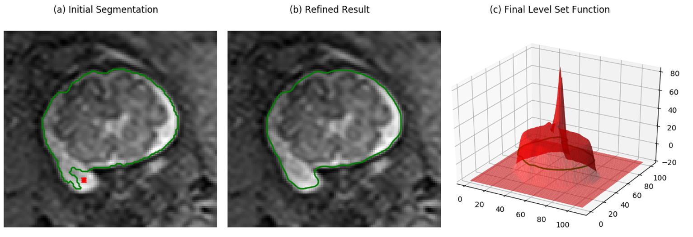

### UGIR: Uncertainty-Guided Interactive Refinement for Segmentation
This repository provides the code for the following MICCAI 2020 paper ([Arxiv link][arxiv_link]). If you use some modules of our repository, please cite this paper. 
*Guotai Wang, Michael Aertsen, Jan Deprest, Sébastien Ourselin, Tom Vercauteren, Shaoting Zhang:
Uncertainty-Guided Efficient Interactive Refinement of Fetal Brain Segmentation from Stacks of MRI Slices. MICCAI (4) 2020: 279-288. 

The code contains two modules: 1), a novel CNN based on convolution in Multiple Groups (MG-Net) that simultaneously obtains an intial segmentation and its uncertainty estimation. 2), Interaction-based level set for fast refinement, which is an extention of the DRLSE algorithm and named as I-DRLSE. 


Fig. 1. Structure of MG-Net.


Fig. 2. Segmentation with uncertainty estimation.


Fig. 3. Using I-DRLSE for interactive refinement.

### Requirements
Some important required packages include:
* [Pytorch][torch_link] version >=1.0.1.
* [PyMIC][pymic_link], a pytorch-based toolkit for medical image computing. Version 0.2 is required. 
* [GeodisTK][geodistk_link], geodesic distance transform toolkit for 2D and 3D images.

Follow official guidance to install [Pytorch][torch_link]. Install the other required packages by:
```
pip install -r requirements.txt
```

[arxiv_link]:https://arxiv.org/abs/2007.00833
[torch_link]:https://pytorch.org/
[pymic_link]:https://github.com/HiLab-git/PyMIC
[geodistk_link]:https://github.com/taigw/GeodisTK

### How to use
After installing the required packages, add the path of `UGIR` to the PYTHONPATH environment variable. 
### Demo of MG-Net
1. Run the following commands to use MG-Net for simultanuous segmentation and uncertainty estimation. 
```
cd uncertainty_demo
python ../util/custom_net_run.py test config/mgnet.cfg
```
2. The results will be saved to `uncertainty_demo/result`. To get a visualization of the uncertainty estimation in an example slice, run: 
```
python show_uncertanty.py
```

### Demo of I-DRLSE
To see a demo of I-DRLSE, run the following commands:
```
cd util/level_set
python demo/demo_idrlse.py 
```
The result should look like the following.


### Copyright and License
Copyright (c) 2020, University of Electronic Science and Technology of China.
All rights reserved. This code is made available as open-source software under the BSD-3-Clause License.
